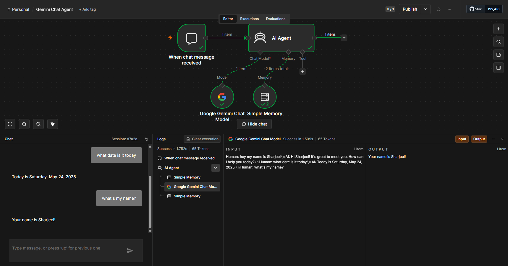

# Gemini Chat Agent

A simple conversational AI agent built with n8n and Google Gemini.

## What it does
Chat interface powered by Gemini 1.5 Flash via n8n's AI Agent node.

## Nodes used
- Chat Trigger
- AI Agent (Conversational)
- Google Gemini Chat Model
- Simple Memory

## Screenshot

  

## Setup
1. Import the workflow JSON into n8n
2. Add your Gemini API key to the Gemini node credentials
3. Run the Chat Trigger and start chatting
